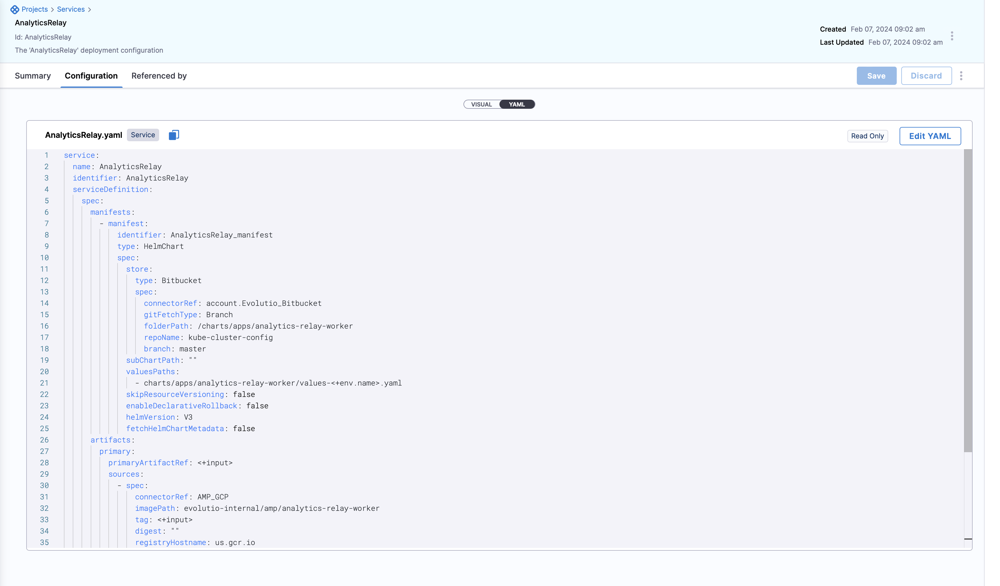

# Terraform Harness Configuration

This Terraform configuration sets up a Harness Next Gen service using the Harness provider. It dynamically generates deployment configurations based on the specified service type and deploys them using Terraform with Harness Provider.

## Prerequisites

- Terraform >= 1.4.6
- Access to a Harness account with permissions to create services
- Harness API key with appropriate permissions

## Configuration

The configuration uses the Harness provider to deploy services based on templates. It supports dynamic service creation by rendering YAML configurations for different service types.

### Required Providers

- **Harness**: Used to configure and deploy services in the Harness platform.

### Provider Configuration

Configure the Harness provider with your Harness account details:

- `harness_endpoint`: The API endpoint for Harness.
- `harness_account_id`: Your Harness account ID.
- `harness_api_key`: The API key for accessing Harness.

### Variables

Variables are defined in `variables.tf` and can be configured in a `.tfvars` file or passed directly via the command line. Here's a list of key variables:

- `service_name`: The name of the service to be deployed.
- `service_type`: The type of service, which determines the template used for deployment.
- `harness_endpoint`, `harness_account_id`, `harness_api_key`: Credentials and endpoint for Harness.
- `organization_id`, `project_id`: Identifiers for the organization and project within Harness.

Service related variables can be found in `service_variables.tf`.  It's a good idea to always define a default value.  Not all services use the same number of variables.

- Variables for configuring the deployment, such as `manifest_connector_ref`, `folder_path`, `manifest_repo_type`, etc.


### tfvars File

Create a `terraform.tfvars` file to easily manage your variables for different environments or configurations. Example:

```hcl
service_name = "example-service"
service_type = "NativeHelm"
harness_endpoint = "https://app.harness.io"
harness_account_id = "your_account_id"
harness_api_key = "your_api_key"
organization_id = "org_xyz"
project_id = "proj_abc"
# Additional variables...
```

## Customizing Templates for Terraform Configuration

Templates play a crucial role in this Terraform configuration, enabling the dynamic generation of deployment configurations based on the specified service type. Stored in the `templates/` directory, these templates are selected and rendered according to the `service_type` variable provided.

### Terraform Configuration for YAML Rendering

The Terraform configuration utilizes a `locals` block to dynamically render a YAML file. This is achieved by using the `templatefile` function, which interpolates variables into a template and produces a rendered output. This method is particularly useful for creating configuration files for services or applications that require customization based on environment, deployment parameters, or other conditions.

### How It Works

The `locals` block is a construct in Terraform that allows for the definition of local variables. These variables can be composed of expressions that make use of input variables, other local variables, or any data accessible in the Terraform configuration.

We can pass in MORE variables than what the template requires.  Overflow variables will simply be ignored.  However EVERY variable in the template MUST EXIST in the local configuration. 

### Template Structure

Each template is named to correspond with the service type it represents. For example, a template for a `NativeHelm` service type would be named `NativeHelm.yaml.tpl`. Terraform's `templatefile` function is utilized within these templates to interpolate variables, thereby generating the final YAML configuration.

Template Structure varies by the type of service that is being configured.  The easiest way to get the yaml structure is to find or create a dummy service within the Harness platform and then view the yaml within within the browser.  Example Below.  



### Modifying Templates

To tailor a template for a specific service type, follow these steps:

1. **Navigate** to the `templates/` directory.
2. **Open** the `.tpl` file that corresponds to the service type you wish to modify.
3. **Make your changes** to the template. Terraform interpolation syntax can be employed to include variables passed from the Terraform configuration.
4. **Save** your changes.

### Adding New Templates

Should you need to add a new template for a different service type, proceed as follows:

1. **Create** a new `.tpl` file within the `templates/` directory, ensuring its name matches the new service type (e.g., `CustomService.yaml.tpl`).
2. **Define** the YAML structure required for your service, incorporating any necessary Terraform variables using interpolation syntax.
3. **Update** your Terraform configuration to account for the new service type, making sure the corresponding variables are passed to the template.

This method affords significant flexibility in managing various types of services and their configurations within the Harness platform.
